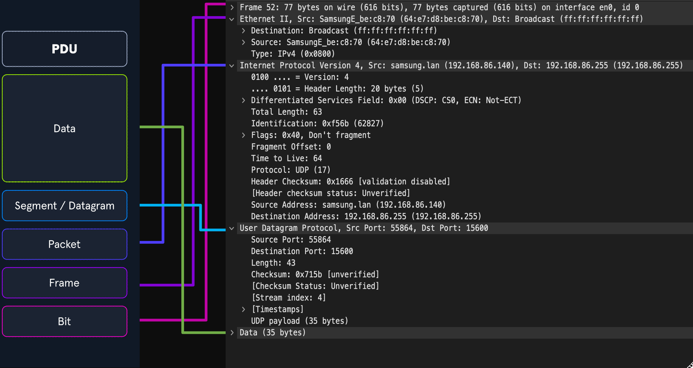

Les couches 1 à 4 du modèle OSI sont axées sur le contrôle du transport des données entre les hôtes qui comprend tout, du support physique utilisé pour la transmission.

Les couches 5 à 7 gèrent l'interprétation, la gestion et la présentation des données encapsulées présentées à l'utilisateur final. 

Considérez le modèle OSI comme la théorie sur laquelle tout fonctionne, tandis que le modèle TCP-IP est plus étroitement aligné sur la fonctionnalité réelle du réseau.

**Décomposition des paquets PDU**
Une PDU est un paquet de données composé d'informations de contrôle et de données encapsulées à partir de chaque couche du modèle OSI.

